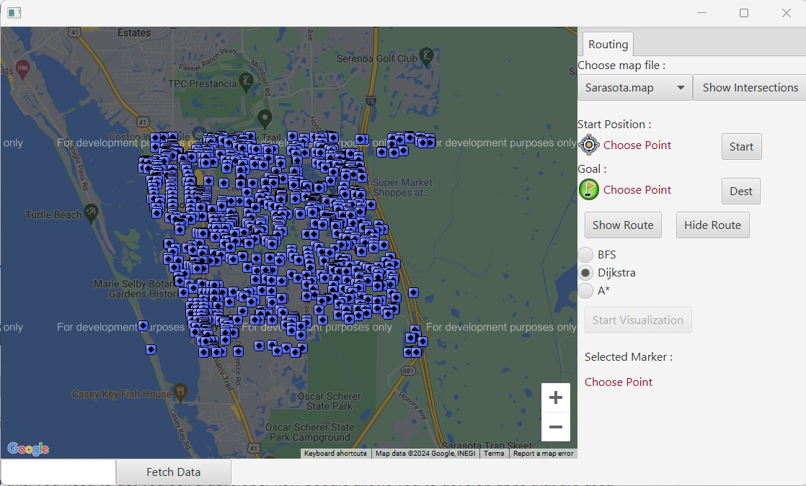
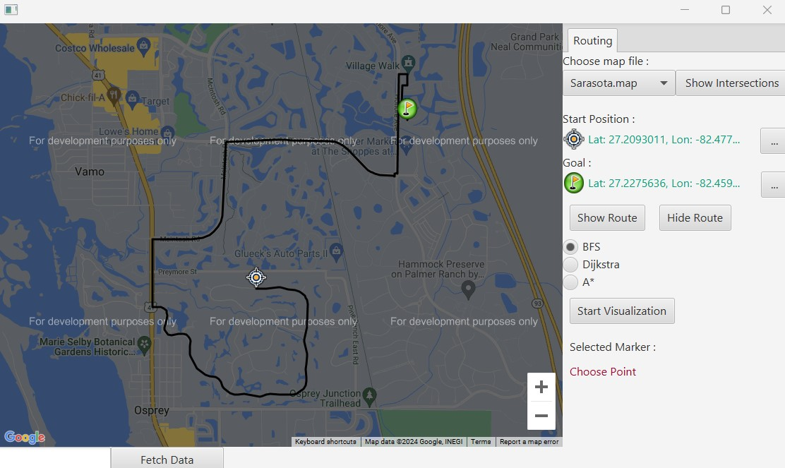

# BreadthFirstSearchOnMap
User can choose the start and end intersections to show the shortest route between them.
Implement using the Breadth First Search method and related methods on Google map.

To run this application, first of all you need to obtain and use your Google Maps API Javascript Developer Key.

Go to https://developers.google.com/maps/documentation/javascript/ to get the key.

Open the file src/html/index.html and replace [APIKeyHere] with your own key.

Then you are good to go! Good luck!